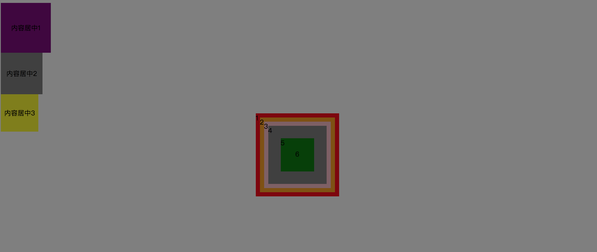

div水平垂直居中以及内容水平垂直居中的各种办法。5种div水平垂直居中，3中内容水平垂直居中。

## 一、div水平垂直居中

###  1、使用position:absolute,设置left、top、margin-left、margin-top的属性.这种方法基本浏览器都能够兼容，不足之处就是需要固定宽高。

```css
.div1 {
    position: absolute;
    width: 200px;
    height: 200px;
    top: 50%;
    left: 50%;
    margin-top: -100px;
    margin-left: -100px;
    background: red;
 }
```

### 2、使用position:fixed,同样设置left、top、margin-left、margin-top的属性

```css
.div2 {
    position: fixed;
    width: 180px;
    height: 180px;
    top: 50%;
    left: 50%;
    margin-top: -90px;
    margin-left: -90px;
    background: orange;
}
```

### 3、利用position:fixed属性，margin:auto这个必须不要忘记了。

```css
.div3 {
    position: fixed;
    width: 160px;
    height: 160px;
    top: 0;
    right: 0;
    bottom: 0;
    left: 0;
    margin: auto;
    background: pink;
}
```

### 4、利用position:absolute属性，设置top/bottom/right/left。

```css
.div4 {
    position: absolute;
    width: 140px;
    height: 140px;
    top: 0;
    right: 0;
    bottom: 0;
    left: 0;
    margin: auto;
    background: grey;
}
```

### 5、使用css3的新属性transform:translate(x,y)属性。

```css
.div5 {
    position: absolute;
    width: 80px;
    height: 80px;
    top: 50%;
    left: 50%;
    -webkit-transform: translate(-50%, -50%);
    -moz-transform: translate(-50%, -50%);
    -ms-transform: translate(-50%, -50%);
    transform: translate(-50%, -50%);
    background: green;
}
```

### 6、使用:before元素

```css
.div6 {
    position: fixed;
    display: block;
    top: 0;
    right: 0;
    bottom: 0;
    left: 0;
    text-align: center;
    background: rgba(0, 0, 0, .5);
}
.div6:before {
    content: '';
    display: inline-block;
    vertical-align: middle;
    height: 100%;
}
.div6 .content {
    display: inline-block;
    vertical-align: middle;
    width: 60px;
    height: 60px;
    line-height: 60px;
    color: red;
    background: yellow;
}
```

## 二、div内容水平垂直居中

### 1、利用display:table-cell属性使内容垂直居中。

```css
.div21 {
    display: table-cell;
    vertical-align: middle;
    text-align: center;
    width: 120px;
    height: 120px;
    background: purple;
}
```

### 2、最简单的一种使行内元素居中的方法，使用line-height属性。这种方法也很实用，比如使文字垂直居中对齐。

```css
.div22 {
    width: 100px;
    height: 100px;
    line-height: 100px;
    text-align: center;
    background: gray;
}
```

### 3、使用css3的display:-webkit-box属性，再设置-webkit-box-pack:center/-webkit-box-align:center。

```css
.div23 {
    width: 90px;
    height: 90px;
    display: -webkit-box;
    -webkit-box-pack: center;
    -webkit-box-align: center;
    background: yellow;
    color: black;
}
```


## 三、实际demo

- html

```html
<!DOCTYPE html>
<html>

<head>
    <meta charset="UTF-8">
    <title>css居中显示</title>
    <style>
    .div1 {
        position: absolute;
        width: 200px;
        height: 200px;
        top: 50%;
        left: 50%;
        margin-top: -100px;
        margin-left: -100px;
        background: red;
    }
    .div2 {
        position: fixed;
        width: 180px;
        height: 180px;
        top: 50%;
        left: 50%;
        margin-top: -90px;
        margin-left: -90px;
        background: orange;
    }
    .div3 {
        position: fixed;
        width: 160px;
        height: 160px;
        top: 0;
        right: 0;
        bottom: 0;
        left: 0;
        margin: auto;
        background: pink;
    }
    .div4 {
        position: absolute;
        width: 140px;
        height: 140px;
        top: 0;
        right: 0;
        bottom: 0;
        left: 0;
        margin: auto;
        background: grey;
    }
    .div5 {
        position: absolute;
        width: 80px;
        height: 80px;
        top: 50%;
        left: 50%;
        transform: translate(-50%, -50%);
        -webkit-transform: translate(-50%, -50%);
        -moz-transform: translate(-50%, -50%);
        -ms-transform: translate(-50%, -50%);
        background: green;
    }

    .div6 {
        position: fixed;
        display: block;
        top: 0;
        right: 0;
        bottom: 0;
        left: 0;
        text-align: center;
        background: rgba(0, 0, 0, .5);
    }
    .div6:before {
        content: '';
        display: inline-block;
        vertical-align: middle;
        height: 100%;
    }
    .div6 .content {
        display: inline-block;
        vertical-align: middle;
        width: 60px;
        height: 60px;
        line-height: 60px;
        color: red;
        background: yellow;
    }

    .div21 {
        display: table-cell;
        vertical-align: middle;
        text-align: center;
        width: 120px;
        height: 120px;
        background: purple;
    }
    .div22 {
        width: 100px;
        height: 100px;
        line-height: 100px;
        text-align: center;
        background: gray;
    }
    .div23 {
        width: 90px;
        height: 90px;
        display: -webkit-box;
        -webkit-box-pack: center;
        -webkit-box-align: center;
        background: yellow;
        color: black;
    }
    
    </style>
</head>

<body>
    <div class="div1">1</div>
    <div class="div2">2</div>
    <div class="div3">3</div>
    <div class="div4">4</div>
    <div class="div5">5</div>
    <div class="div6">6</div>
    <div class="div21">内容居中1</div>
    <div class="div22">内容居中2</div>
    <div class="div23">内容居中3</div>
</body>

</html>
```

- 效果图




> 具体见【[demo](/widget/css/center.html)】