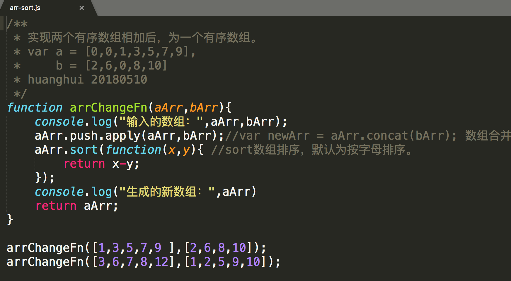
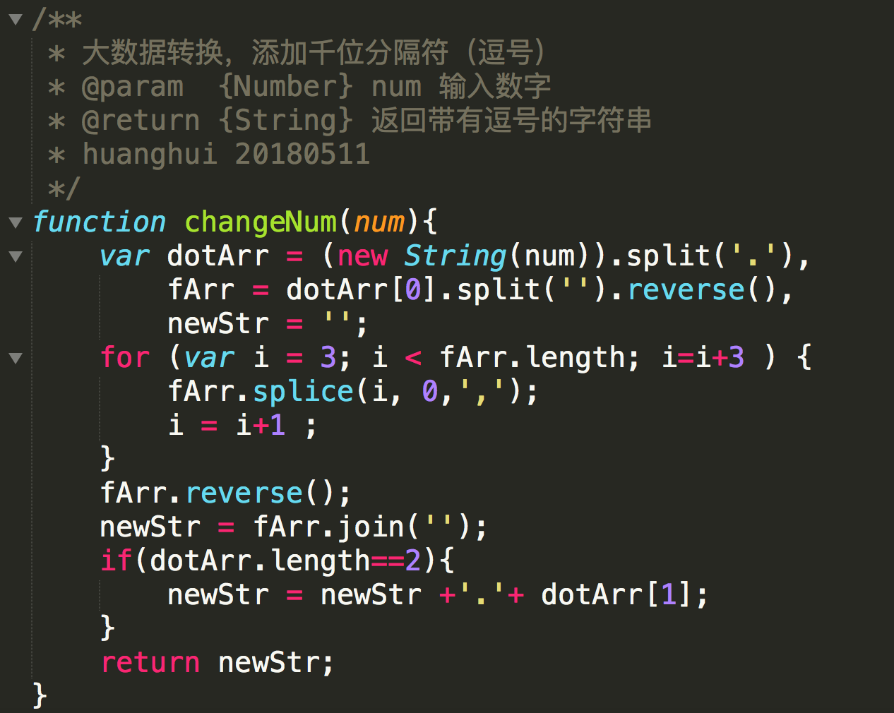
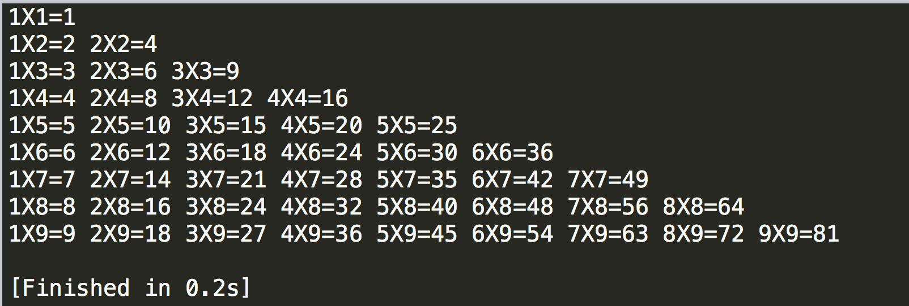
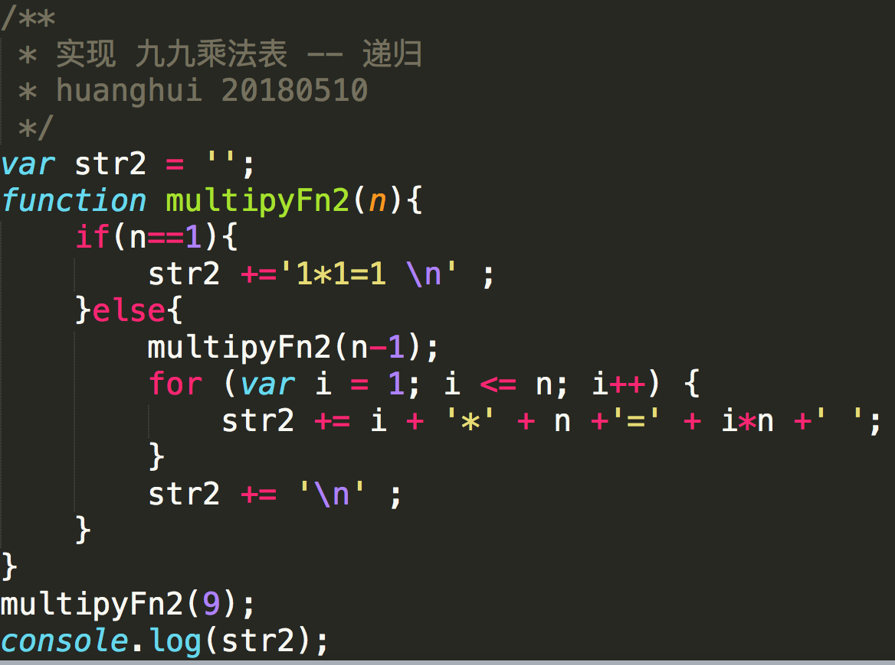
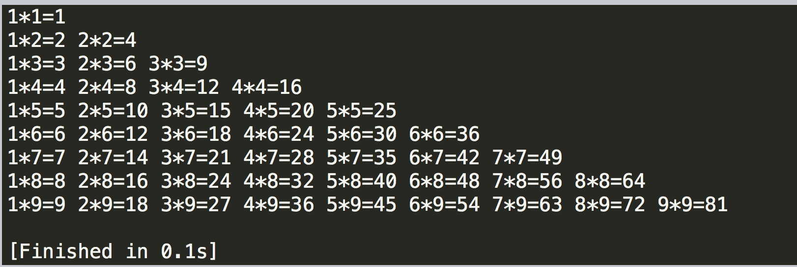
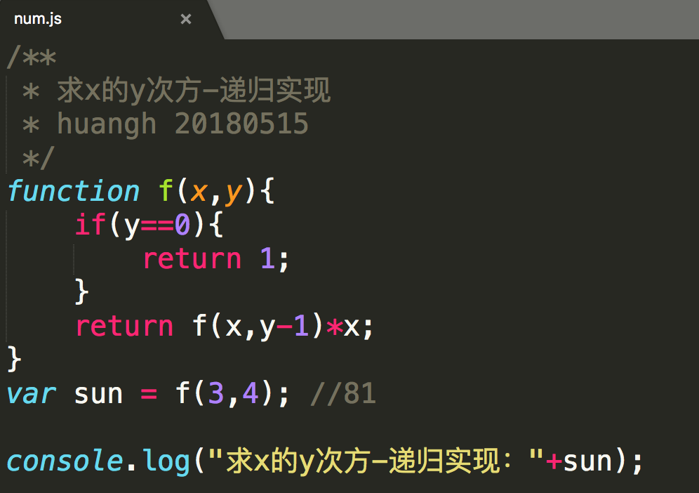
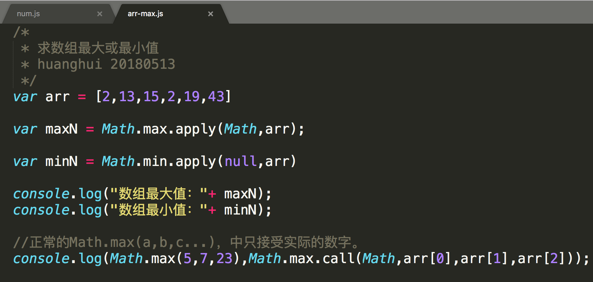
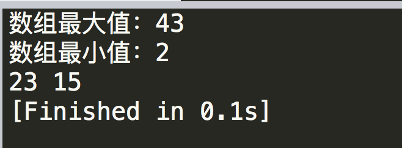

js中经常遇到的一些基本算法的实现：1、实现两个有序数组相加后，为一个有序数组。2、大数据转换，添加千位分隔符（逗号）。3、九九乘法表。4、对象数组和类数组对象的转换。

## 1、实现两个有序数组相加后，为一个有序数组。

- 代码：

    

- 效果图：

    

- [demo](https://github.com/huanghui8030/JS-base/blob/master/demo-zyb/arr-sort.js)

## 2、大数据转换，添加千位分隔符（逗号）

- 代码：

    

- 效果：

    

- [demo](https://github.com/huanghui8030/JS-base/blob/master/demo-zyb/num-str.js)

## 3、九九乘法表

### for循环

- 代码

    

- 效果：

    

- [demo](https://github.com/huanghui8030/JS-base/blob/master/demo-zyb/multipy.js)

### 递归

- 代码：

    

- 效果：

    

- [demo](https://github.com/huanghui8030/JS-base/blob/master/demo-zyb/multipy.js)

## 4、数组和类数组对象的转换

- 要求：

  - 对象数组：var arr = [{'张三':[23,54,65,56]},{'李四':[98,87,87]}]
  - 转为数组对象：var obj = {[{'name':'张三','type':'23'},{'name':'张三','type':'54'}] ...}

- 代码：

  

- 结果：

  

- [demo](https://github.com/huanghui8030/JS-base/blob/master/demo-zyb/arr-obj.js)

## 5、求x的y次方-递归实现

- 代码

  

- 结果

  

- [demo](https://github.com/huanghui8030/JS-base/blob/master/demo-zyb/num.js)

## 6、求数组最大最小值

- 代码

  

- 结果

  

- [demo](https://github.com/huanghui8030/JS-base/blob/master/demo-zyb/arr-max.js)

- ​

> [具体代码](https://github.com/huanghui8030/JS-base/tree/master/demo-zyb/)