Mocha命令行用法：基本用法、异步请求测试、ajax异步请求测试、定制生成格式、添加默认配置、浏览器显示测试结果、单元测试实例、在gulp中运行Mocha测试。

## 1、Mocha单元测命令行基本用法

- mocha命令的基本格式是：`mocha [debug][options][files]`

- 基本用法 

- - mocha：默认运行test子目录里面的测试脚本，不包括子文件
  - mocha add.test.js：当前目录下面的该测试脚本。
  - mocha file1 file2 file3 ：  mocha命令后面紧跟测试脚本的路径和文件名，可以指定多个测试用例。

- 通配符

- - mocha spec/{my,awesome}.js
  - mocha test/unit/*.js

- 命令行参数 mocha  --help：查看所有命令

- - mocha --recursive：执行test子目录下面的所有的测试用例。
  - mocha --watch：-w 监控执行
  - mocha --timeout 5000 timeout.test.js：-t 异步测试中需要，默认时间为2000。

> 详见【[demo6](https://github.com/huanghui8030/Mocha/tree/master/demo06)】

## 2、异步请求测试

### 普通异步请求

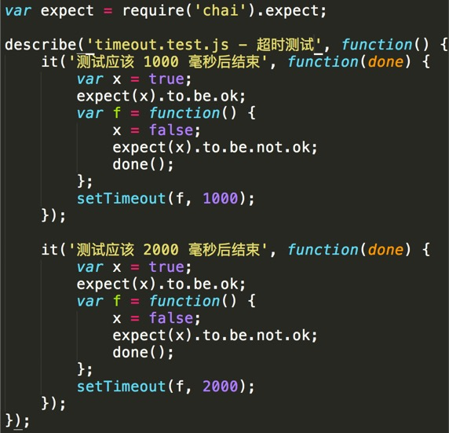

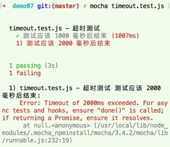

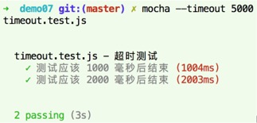

- done：一个it里面只有一个done。done标识回调的最深处，也是嵌套回调函数的末端。必须有，否则报错。
- 超时解决：mocha --timeout 3000 timeout.test.js  

### ajax异步请求测试

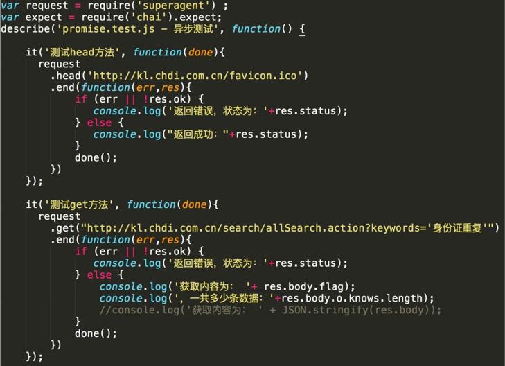

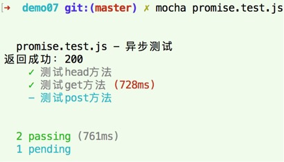

- del/head/get/post/put和别的http动作都可以使用。
- request、end、send、set，均可使用，详见：SuperAgent中文使用文档

> 详见【[demo7](https://github.com/huanghui8030/Mocha/tree/master/demo07)】

## 3、定制生成格式

- mocha --reporter  spec：默认为spec格式，可设置其他格式。

- -- reporter 简写 -R

- 生成MD格式

  - mocha --recursive -R markdown > spec.md 。
    - 上面命令根据test目录的所有测试脚本，生成一个规格文件spec.md。-R markdown参数指定规格报告是markdown格式。
  - mocha --recursive -R doc > spec.html  
  - >  详见【[demo8](https://github.com/huanghui8030/Mocha/tree/master/demo08)】

- 添加mochawesome格式，网页版查看

  

  - 安装项目依赖：npm install --save-dev mochawesome

  - 执行：mocha --reporter mochawesome

    >  详见【[demo9](https://github.com/huanghui8030/Mocha/tree/master/demo09)】

## 4、添加默认配置

- test测试目录下新建mocha.opts

  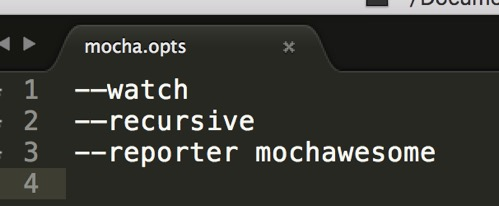

- 例如：mocha --reporter mochawesome --recursive --watch

- 执行：mocha

- 常看页面

  

  > 详见【[demo10](https://github.com/huanghui8030/Mocha/tree/master/demo10)】

  ​

## 5、浏览器显示测试结果

- 动态生成模板：mocha init test，自动生成一个test目录

  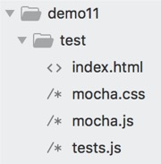

- 其中tests.js是空的，需要自己写（建议将tests.js改成target.test.js）

- 在html中添加断言库、对应需要测试的target.js。

  - 添加断言库：``
  - 添加需要测试的js：``

  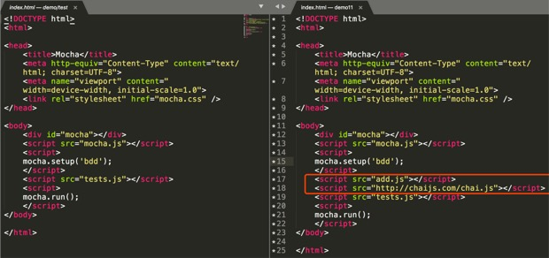

- 在浏览器里面打开index.html，就可以看到测试脚本的运行结果。

  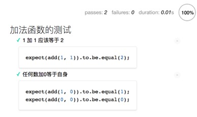

  >  详见【[demo11](https://github.com/huanghui8030/Mocha/tree/master/demo11)】

## 6、单元测试实例

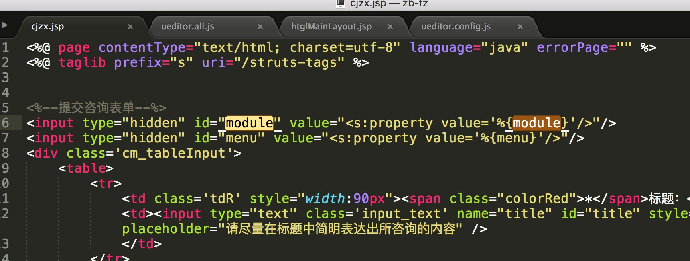

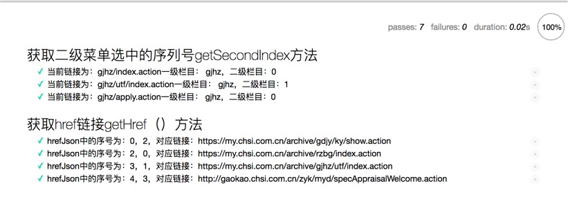

>  详见【[demo12](https://github.com/huanghui8030/Mocha/tree/master/demo12)】

## 7、在 gulp中运行Mocha测试

- 建立下图所示目录结构。

  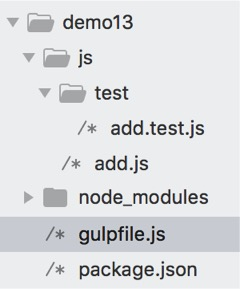

- 安装gulp-mocha插件：cnpm install  - -save-dev gulp-mocha

- 编写“mocha”任务，如下图。

  

- 执行：gulp

  > 详见【[demo13](https://github.com/huanghui8030/Mocha/tree/master/demo13)】

