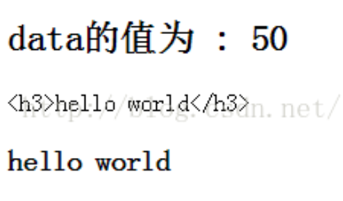

express中ejs模板，可以转化为html格式的文档，但是使用方法还是ejs模板中的方法。

- 将模板ejs设置为html

```js
//模板设置为html
app.set('views', path.join(__dirname, 'views'));
app.engine("html",require("ejs").__express);
app.set('view engine', 'html');
```


## 用法

ejs模板学习起来非常简单,类似html,标签和jsp里的java代码标签差不多.

常用标签:

```java
<%%>
<%=%>
<%-%>
<%include %>
<%for(){}%>
<%if(){}%> if-else
```

- <%%>标签里可以写js代码-定义变量

  ```html
  <% var data = 50;var hello = '<h3>hello world</h3>' %>  
  ```

- <%=%>和<%-%> 区别 前者不会编译,后者会编译。

  ```js
  <h2>data的值为 : <%=data%></h2>  
  <%=hello%>，显示h3标签
  <%-hello%> ，不显示h3标签
  ```

  结果：

  

- <%include %>， 包含其他ejs文件,一般用于包含头部引用和页面相同的部分

- <%for(){}%>，一般用于后端查询出一段数组数据,前端展示。

- <%if(){}%> if-else，判断 一般都和for结合使用，也可单独使用。